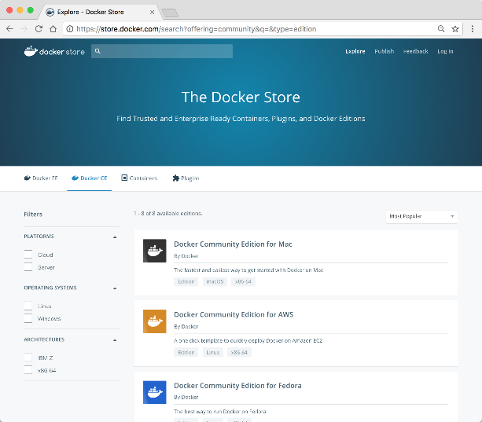
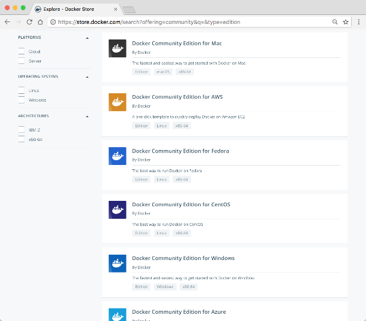
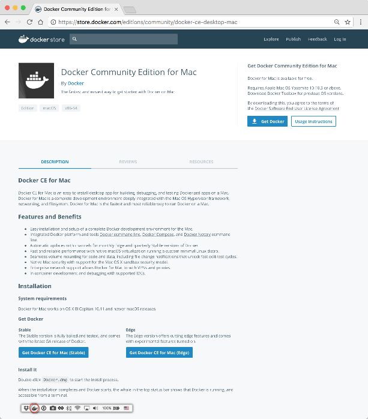
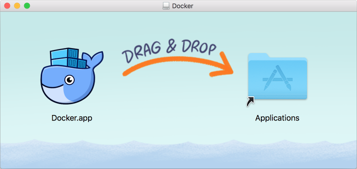
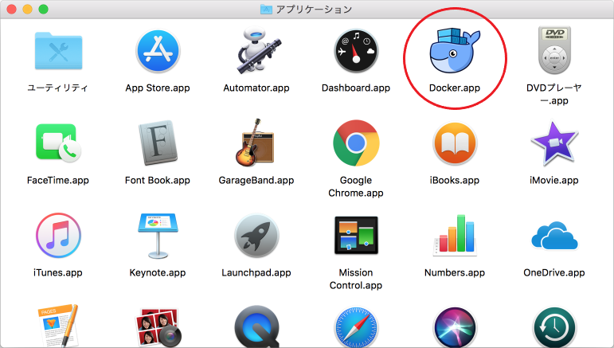
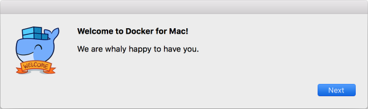
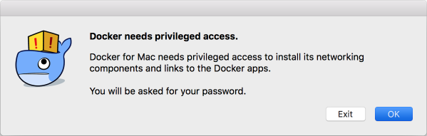
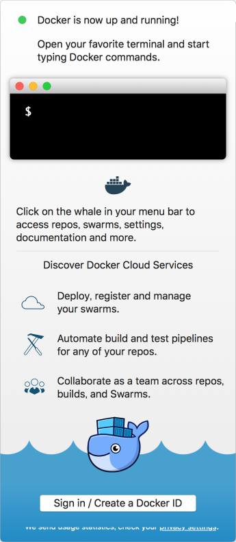
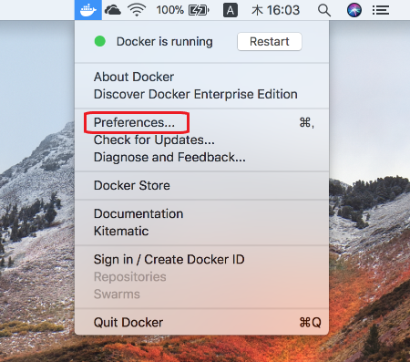
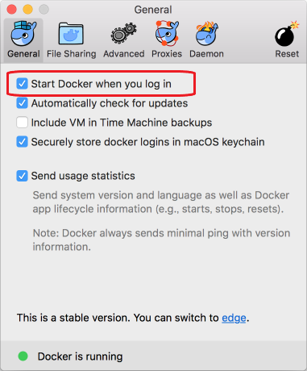

# [Mac環境] Docker for Mac のインストール

## インストーラーのダウンロード

Docker公式ダウンロードサイト「Docker Store」から、無償の「Docker Community Edition」をダウンロードします。  
<https://store.docker.com/search?offering=community&type=edition>



「Docker Community Edition for Mac」を選びます。



「Get Docker」または「Get Docker CE for Mac (stable)」をクリックしてダウンロードします。  
(特に理由が無ければ「Stable(安定版)」の方にします)



[ファイル情報]  
・ファイル名： Docker.dmg  
・ファイルサイズ： 約134MB (バージョン17.09.0)


## インストール

ダウンロードしたインストーラー(ディスクイメージ)をダブルクリックしてマウントします。  
以下のような画面が表示されるので、画面の指示通りに「Docker.app」アイコンを「Applications」に向かってドラッグ＆ドロップします。



「Applications」フォルダを開いて、「Docker」アイコンをダブルクリックします。



以下の画面が表示されるので、「Next」ボタンを押します。

  

Dockerのインストールのために特権アクセスの許可を求められるので、「OK」ボタンを押します。  
Macのログインパスワードを求められるので、入力します。



しばらくすると、Dockerが起動します。  
初回のみ、以下の画面が表示されますが、何もせずに閉じてしまって構いません。




## インストール後の確認

ターミナルから、以下のコマンドを実行します。

```
$ docker version
```

以下のように表示されれば正しくインストールされています。

```
Client:
 Version:      17.09.0-ce
 API version:  1.32
 Go version:   go1.8.3
 Git commit:   afdb6d4
 Built:        Tue Sep 26 22:40:09 2017
 OS/Arch:      darwin/amd64

Server:
 Version:      17.09.0-ce
 API version:  1.32 (minimum version 1.12)
 Go version:   go1.8.3
 Git commit:   afdb6d4
 Built:        Tue Sep 26 22:45:38 2017
 OS/Arch:      linux/amd64
 Experimental: true
```


## Docker の簡易な動作確認

Docker社が用意しているサンプルコンテナを実行してみましょう。  
ターミナルから、以下のコマンドを実行します。

```
$ docker run hello-world
```

初回の実行であれば、以下のように表示されるはずです。  
これは、ローカル上に「hello-world」というコンテナが存在しないので、「Docker Hub」と呼ばれる公開リポジトリからダウンロード(pull)していることを示します。

```
Unable to find image 'hello-world:latest' locally
latest: Pulling from library/hello-world
5b0f327be733: Pull complete 
Digest: sha256:b2ba691d8aac9e5ac3644c0788e3d3823f9e97f757f01d2ddc6eb5458df9d801
Status: Downloaded newer image for hello-world:latest
```

続けて、ダウンロードされた「hello-world」コンテナの実行結果が表示されます。

```
Hello from Docker!
This message shows that your installation appears to be working correctly.

To generate this message, Docker took the following steps:
 1. The Docker client contacted the Docker daemon.
 2. The Docker daemon pulled the "hello-world" image from the Docker Hub.
 3. The Docker daemon created a new container from that image which runs the
    executable that produces the output you are currently reading.
 4. The Docker daemon streamed that output to the Docker client, which sent it
    to your terminal.

To try something more ambitious, you can run an Ubuntu container with:
 $ docker run -it ubuntu bash

Share images, automate workflows, and more with a free Docker ID:
 https://cloud.docker.com/

For more examples and ideas, visit:
 https://docs.docker.com/engine/userguide/
```

上のように出力されていれば、成功です。

これで「Docker for Mac」の準備ができました！！


## (オプション) Docker の起動設定について

前述の通り、デフォルトではMacへのログイン時にDockerが自動的に起動するようになっています。  
もし、「必要時に手動で起動したい」という場合は、以下の手順で設定を変更することができます。

[設定方法]  
ステータスメニューの「Docker」アイコンをクリックして、「Preferences...」を選択します。



「Prefernces」画面が起動するので、「General」タブを選択して、「Start Docker when you log in」のチェックを外します。



これでログイン時にDockerが自動起動しなくなります。
