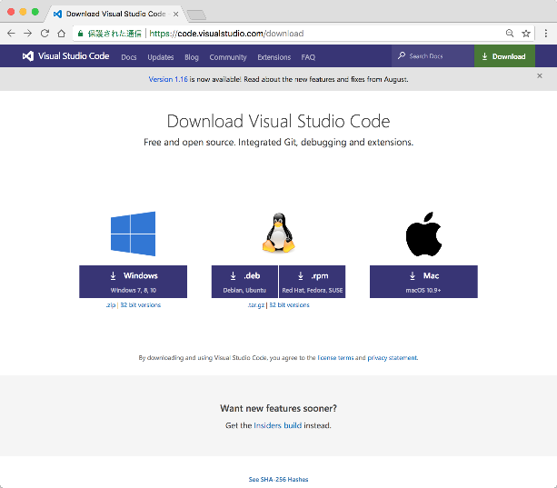
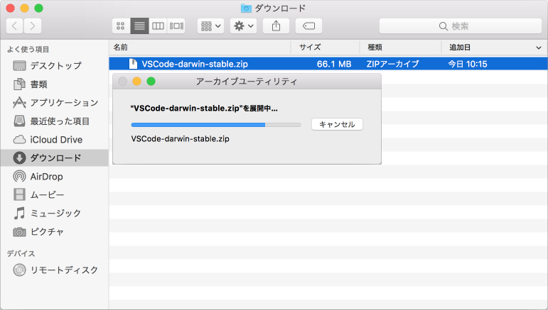
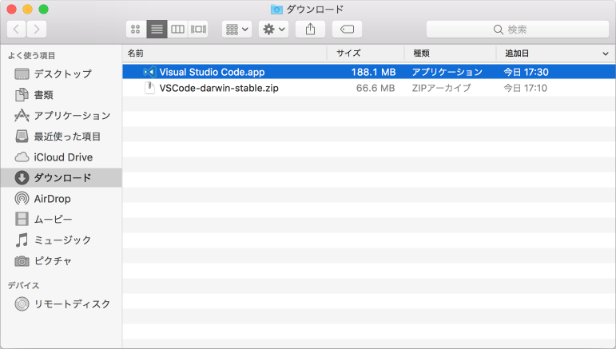
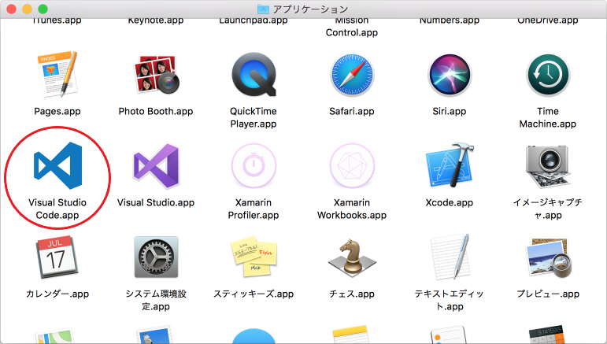
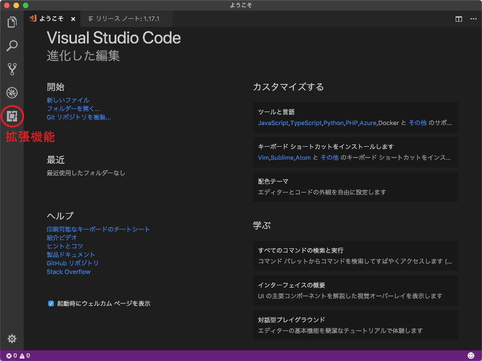
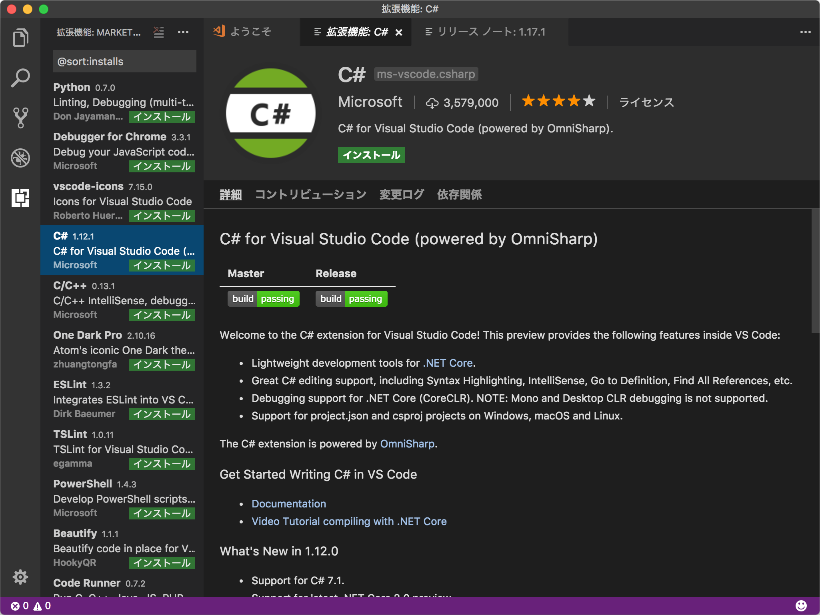
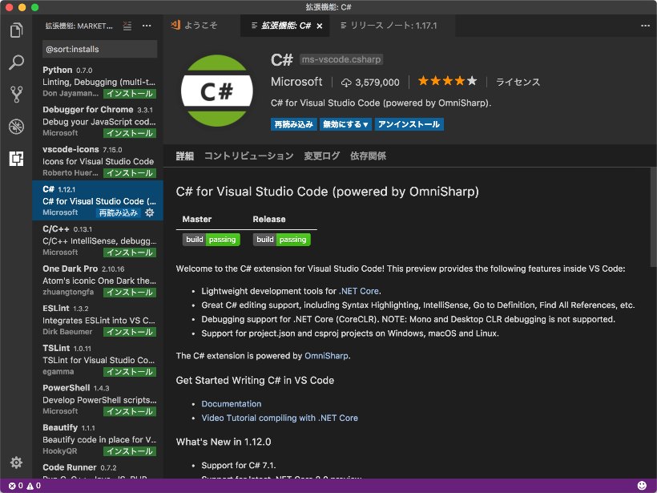
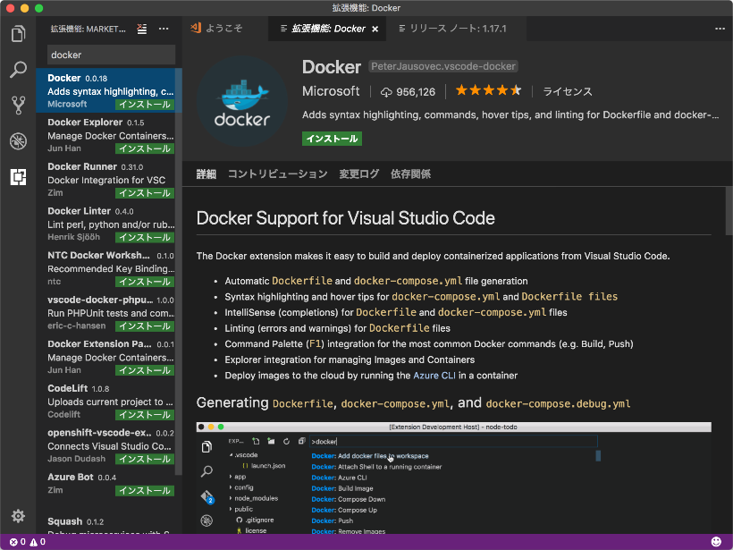

# [Mac環境] Visual Studio Code のインストール

## インストーラーのダウンロード

Microsoft Visual Studio の公式サイトから、「Visual Studio Code」のインストーラーをダウンロードします。  
<https://code.visualstudio.com/download>

[ファイル情報]

・ファイル名： VSCode-darwin-stable.zip  
・ファイルサイズ： 約66MB (バージョン1.16.1)

## インストール

ダウンロードしたzipファイルを展開します。  

「Visual Studio Code.app」というファイルが展開されます。  
このファイルを「アプリケーション」フォルダへドラッグ＆ドロップします。

## 拡張機能のインストール

「アプリケーション」フォルダを開いて、「Visual Studio Code」アイコンをダブルクリックします。

Visual Studio Code が起動します。  
左側の「拡張機能」アイコンをクリックします。

拡張機能のリストから「C#」を選んで、「インストール」をクリックします。

インストールされました。

同様に、リストから「Docker」を選んで、「インストール」をクリックします。  
※ リストで見つからない時は、検索窓に「docker」と入れて検索してください。

インストールされました。

これで「Visual Studio Code」の準備ができました！！
