# [Windows環境] Docker for Windows のインストール

## インストール前の準備：「Hyper-V」機能の有効化

Docker for Windows は、Windowsの「Hyper-V」機能に依存して動作します。  
Docker for Windows をインストールする前に、以下の流れで「Hyper-V」機能を有効化する必要があります。

※ 「Hyper-V」機能を利用できる環境には条件があります。詳しい前提条件は以下のリンクを参照してください。  
<https://docs.microsoft.com/ja-jp/virtualization/hyper-v-on-windows/reference/hyper-v-requirements>  
<https://docs.microsoft.com/ja-jp/virtualization/hyper-v-on-windows/quick-start/enable-hyper-v>


### STEP1： BIOSで「Intel Virtualization Technology (VT)」を有効にする

PCのBIOS設定画面を起動し、「Intel Virtualization Technology (VT)」を有効にします。  
BIOS設定画面の起動方法、設定方法については、各機種のマニュアルを参照してください。


### STEP2：「Windowsの機能の有効化または無効化」で「Hyper-V」機能を有効化する

[GUIで行う場合]

コントロールパネルから「プログラム」→「Windowsの機能の有効化または無効化」を選択します。   
「Hyper-V」にチェックを入れて「OK」を押します。

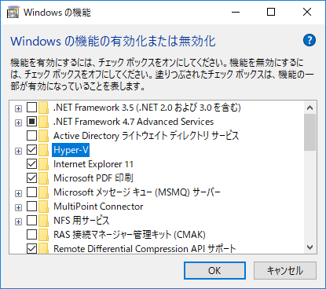

処理が完了すると、Windowsの再起動を要求されます。  
「今すぐ再起動」ボタンを押すと再起動が行われます。

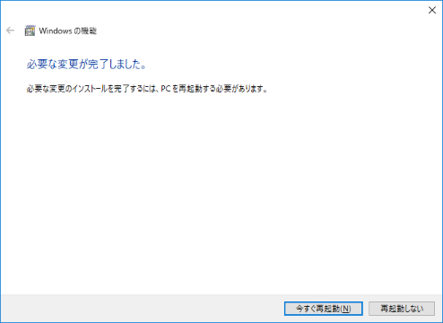


[コマンドラインで行う場合]

コマンドプロンプト または PowerShell を「管理者として起動」して、以下のコマンドを実行します。

```
DISM /Online /Enable-Feature /All /FeatureName:Microsoft-Hyper-V
```

処理が完了すると、Windowsの再起動を要求されます。  
「Y」を入力すると再起動が行われます。

```
機能を有効にしています
[==========================100.0%==========================]
操作は正常に完了しました。
Windows を再起動してこの操作を完了してください。
今すぐコンピューターを再起動しますか? (Y/N)
```


## インストーラーのダウンロード

Docker公式ダウンロードサイト「Docker Store」から、無償の「Docker Community Edition」をダウンロードします。  
<https://store.docker.com/search?offering=community&type=edition>

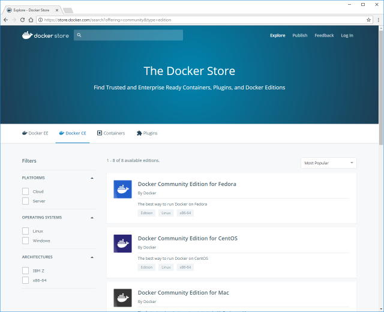

「Docker Community Edition for Windows」を選びます。

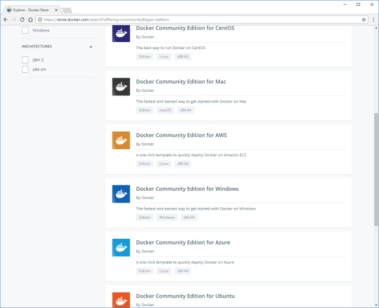

「Get Docker」または「Get Docker CE for Windows (stable)」をクリックしてダウンロードします。  
(特に理由が無ければ「Stable(安定版)」の方にします)

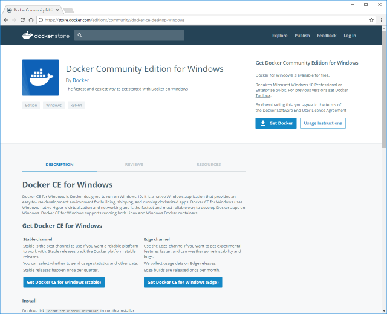

[ファイル情報]  
・ファイル名： Docker for Windows Installer.exe  
・ファイルサイズ： 約126MB (バージョン17.09.0)


## インストール

ダウンロードしたインストーラーを実行します。  
実行すると、確認なしにすぐインストールが開始されるので、注意してください。

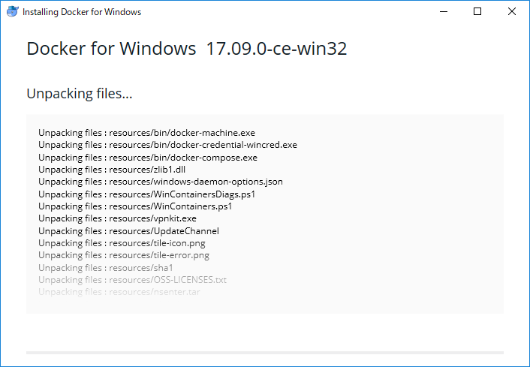

インストールが完了すると、以下のような画面が表示され、Windowsのログアウトを要求されます。  
「Close and log out」ボタンを押すとログアウトが行われます。

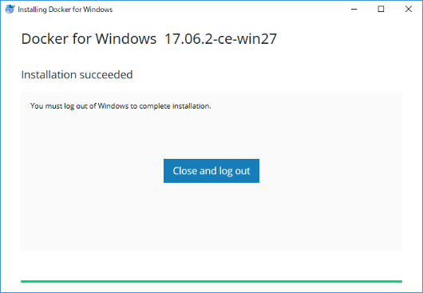

※ 単に「Close」とだけ表示されたボタンが表示される場合もあります。  
その場合は、「Close」ボタンを押してインストーラーを終了した後、手動でWindowsをログアウトします。

再度ログインすると、Dockerが起動します。

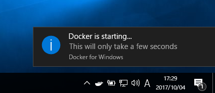  
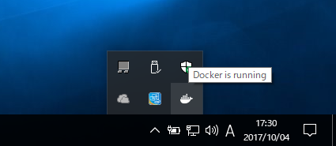

初回のみ、以下の画面が表示されますが、右上の「×」で閉じてしまって構いません。

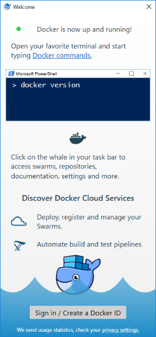


## インストール後の確認

コマンドプロンプト または PowerShell から、以下のコマンドを実行します。

```
> docker version
```

以下のように表示されれば正しくインストールされています。

```
Client:
 Version:      17.09.0-ce
 API version:  1.32
 Go version:   go1.8.3
 Git commit:   afdb6d4
 Built:        Tue Sep 26 22:40:09 2017
 OS/Arch:      windows/amd64

Server:
 Version:      17.09.0-ce
 API version:  1.32 (minimum version 1.12)
 Go version:   go1.8.3
 Git commit:   afdb6d4
 Built:        Tue Sep 26 22:45:38 2017
 OS/Arch:      linux/amd64
 Experimental: true
```


## Docker の簡易な動作確認

Docker社が用意しているサンプルコンテナを実行してみましょう。  
コマンドプロンプト または PowerShell から、以下のコマンドを実行します。

```
> docker run hello-world
```

初回の実行であれば、以下のように表示されるはずです。  
これは、ローカル上に「hello-world」というコンテナが存在しないので、「Docker Hub」と呼ばれる公開リポジトリからダウンロード(pull)していることを示します。

```
Unable to find image 'hello-world:latest' locally
latest: Pulling from library/hello-world
5b0f327be733: Pull complete
Digest: sha256:b2ba691d8aac9e5ac3644c0788e3d3823f9e97f757f01d2ddc6eb5458df9d801
Status: Downloaded newer image for hello-world:latest
```

続けて、ダウンロードされた「hello-world」コンテナの実行結果が表示されます。

```
Hello from Docker!
This message shows that your installation appears to be working correctly.

To generate this message, Docker took the following steps:
 1. The Docker client contacted the Docker daemon.
 2. The Docker daemon pulled the "hello-world" image from the Docker Hub.
 3. The Docker daemon created a new container from that image which runs the
    executable that produces the output you are currently reading.
 4. The Docker daemon streamed that output to the Docker client, which sent it
    to your terminal.

To try something more ambitious, you can run an Ubuntu container with:
 $ docker run -it ubuntu bash

Share images, automate workflows, and more with a free Docker ID:
 https://cloud.docker.com/

For more examples and ideas, visit:
 https://docs.docker.com/engine/userguide/
```

上のように出力されていれば、成功です。

これで「Docker for Windows」の準備ができました！！


## (オプション) Docker の起動設定について

前述の通り、デフォルトではWindowsへのログイン時にDockerが自動的に起動するようになっています。  
もし、「必要時に手動で起動したい」という場合は、以下の手順で設定を変更することができます。

[設定方法]  
タスクバーの通知領域の「Docker」アイコンを右クリックして、「Settings...」を選択します。

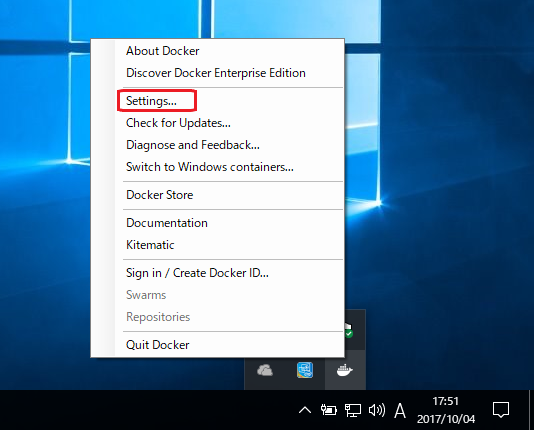

「Settings」画面が起動するので、「General」タブを選択して、「Start Docker when you log in」のチェックを外します。

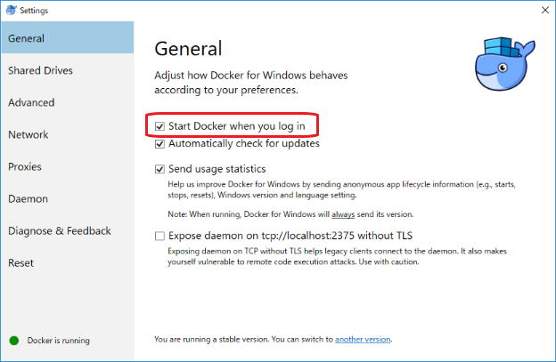

これでログイン時にDockerが自動起動しなくなります。
