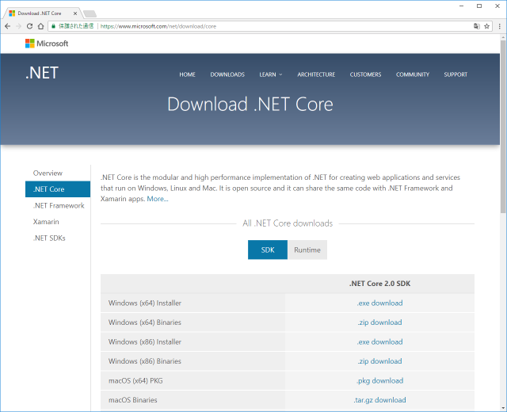
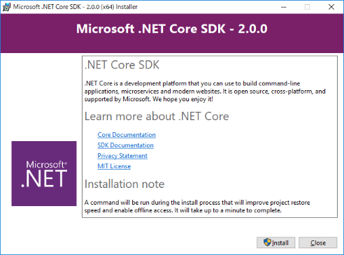
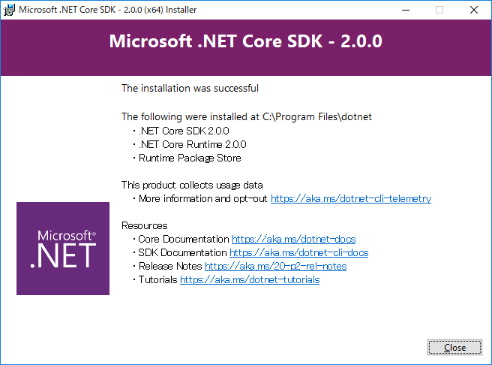

# [Windows環境] .NET Core SDK 2.0 のインストール

## インストーラーのダウンロード

Microsoft .NET の公式サイトから、「.NET Core SDK 2.0」のインストーラーをダウンロードします。  
<https://www.microsoft.com/net/download/core>



※ exe形式とzip形式がありますが、exe形式の方をダウンロードしてください。  
※ OSのビット数に応じて「OSが64bit → x64」「OSが32bit → x86」のいずれかをダウンロードしてください。

[ファイル情報]

(64bitの場合)  
・ファイル名： dotnet-sdk-2.0.0-win-gs-x64.exe  
・ファイルサイズ： 約111MB

(32bitの場合)  
・ファイル名： dotnet-sdk-2.0.0-win-gs-x86.exe  
・ファイルサイズ： 約106MB


## インストール

ダウンロードしたインストーラーを実行します。  
「Install」ボタンを押すとインストールが開始します。



途中での設定項目は特にありません。  
以下の画面が表示されれば、インストール処理は完了です。




## インストール後の確認

コマンドプロンプト または PowerShell から、以下のコマンドを実行します。

```
> dotnet --info
```

以下のように表示されれば正しくインストールされています。

```
.NET コマンド ライン ツール (2.0.0)

Product Information:
 Version:            2.0.0
 Commit SHA-1 hash:  cdcd1928c9

Runtime Environment:
 OS Name:     Windows
 OS Version:  10.0.15063
 OS Platform: Windows
 RID:         win10-x64
 Base Path:   C:\Program Files\dotnet\sdk\2.0.0\

Microsoft .NET Core Shared Framework Host

  Version  : 2.0.0
  Build    : e8b8861ac7faf042c87a5c2f9f2d04c98b69f28d
```


## .NET Core SDK の簡易な動作確認

コマンドプロンプト または PowerShell を起動して、アプリケーションを作成するフォルダへ移動します。  
(例：「C:\Projects」)

```
> cd C:\Projects
```

以下のコマンドを実行して、.NET Core のプロジェクトテンプレートを作成します。  
今回は「コンソールアプリ」のテンプレートを使用します。

```
C:\Projects> dotnet new console -o myapp
```

「myapp」フォルダが作成されているので、移動します。

```
C:\Projects> cd myapp
```

C#ファイルなど、いくつかのファイルが生成されていることが確認できます。

```
C:\Projects\myapp> dir

    ディレクトリ: C:\Projects\myapp

Mode                LastWriteTime         Length Name
----                -------------         ------ ----
d-----       2017/10/04     12:12                obj
-a----       2017/10/04     12:12            178 myapp.csproj
-a----       2017/10/04     12:12            187 Program.cs
```

中身を見てみましょう。

```
C:\Projects\myapp> type Program.cs
using System;

namespace myapp
{
    class Program
    {
        static void Main(string[] args)
        {
            Console.WriteLine("Hello World!");
        }
    }
}
```

このように、テンプレートの内容は「サンプルプログラム」的なソースコードが記述されたものとなっています。  
テンプレートを修正したり、新たなファイルを追加したりして、開発を行って行きます。

今回は、生成されたテンプレートから特に変更せずに、アプリケーションを実行してみましょう。  
「dotnet run」コマンドは、アプリケーションのビルドと実行をまとめて行ってくれるコマンドです。

```
C:\Projects\myapp> dotnet run
Hello World!
```

上のように出力されていれば、成功です。

これで「.NET Core SDK 2.0」の準備ができました！！
