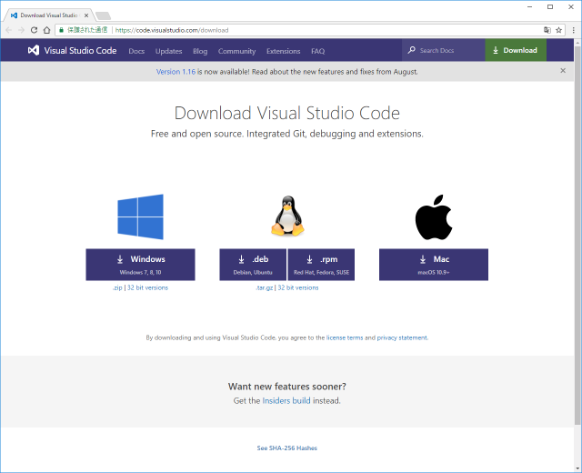
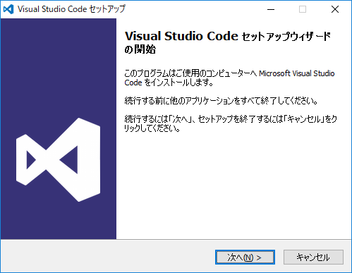
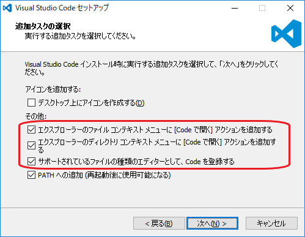
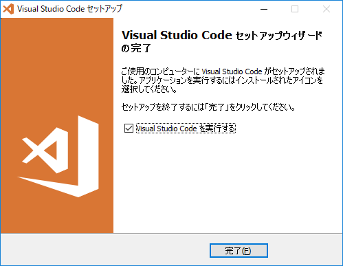
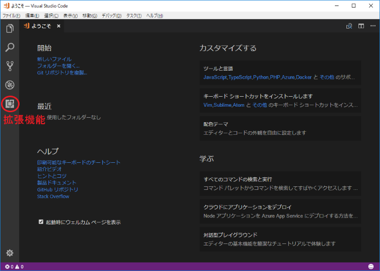
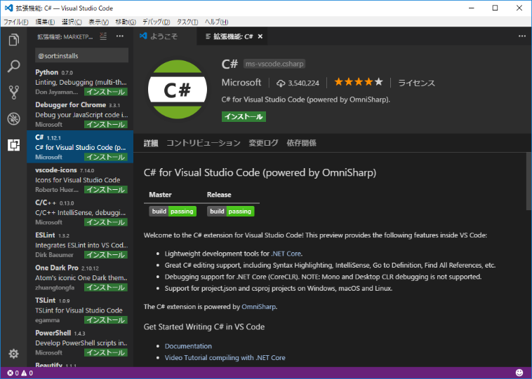
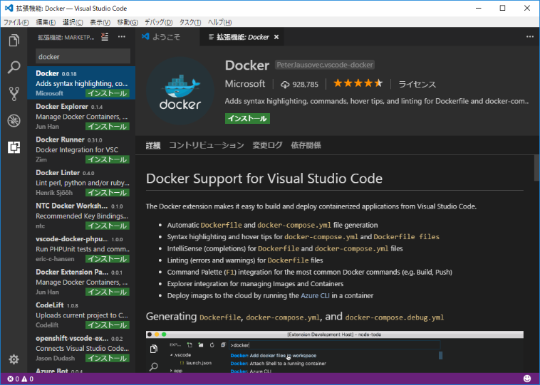
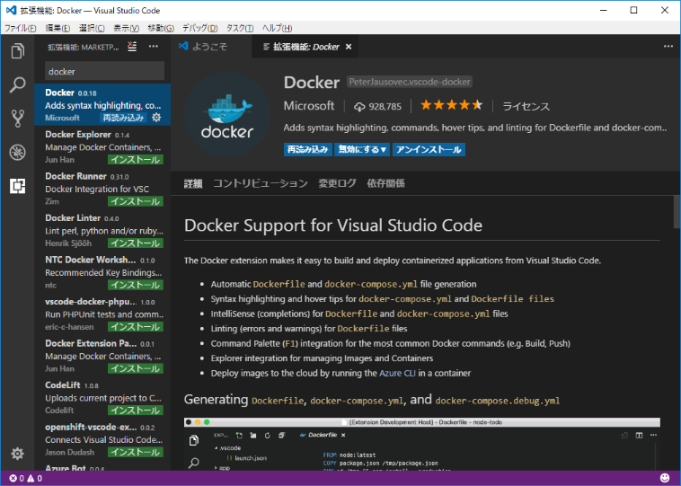

# [Windows環境] Visual Studio Code のインストール

## インストーラーのダウンロード

Microsoft Visual Studio の公式サイトから、「Visual Studio Code」のインストーラーをダウンロードします。  
<https://code.visualstudio.com/download>

※ OSが32bitの場合は「32bit versions」をダウンロードしてください。

[ファイル情報]

(64bitの場合)  
・ファイル名： VSCodeSetup-x64-1.17.1.exe  
・ファイルサイズ： 約40MB

(32bitの場合)  
・ファイル名： VSCodeSetup-ia32-1.17.1.exe  
・ファイルサイズ： 約35MB

## インストール

ダウンロードしたインストーラーを実行します。  
ウィザードの案内に従って進めます。

以下の画面では、下記の項目にチェックを入れておくことを推奨します。

・エクスプローラーのファイル コンテキスト メニューに [Code で開く] アクションを追加する  
・エクスプローラーのディレクトリ コンテキスト メニューに [Code で開く] アクションを追加する  
・サポートされているファイルの種類のエディターとして、Code を登録する

インストール完了の画面で、「Visual Studio Code を実行する」にチェックを入れた状態で「完了」ボタンを押します。

## 拡張機能のインストール

Visual Studio Code が起動します。  
左側の「拡張機能」アイコンをクリックします。

拡張機能のリストから「C#」を選んで、「インストール」をクリックします。

インストールされました。

同様に、リストから「Docker」を選んで、「インストール」をクリックします。  
※ リストで見つからない時は、検索窓に「docker」と入れて検索してください。

インストールされました。

これで「Visual Studio Code」の準備ができました！！
